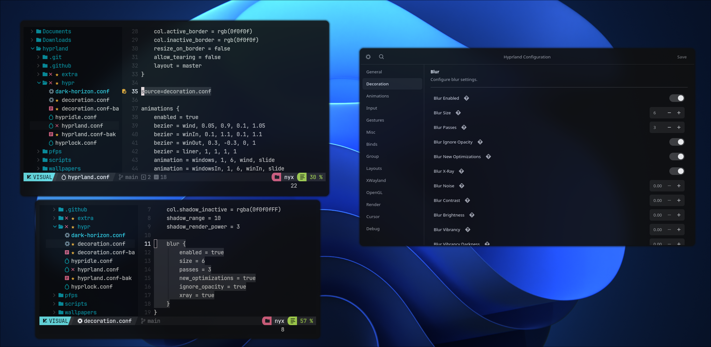

<div align='center'>

<h2>HyprGUI </h2>


An unofficial GUI for configuring Hyprland, built with GTK4 and Rust for Arch.
Comes with a custom hyprparser for Hyprland's configuration file.

## Preview


</div>

Install the package with:
```bash
git clone https://github.com/Firstp1ck/hyprgui.git
cd hyprgui
./setup.sh
```

The `setup.sh` script automates the installation process by:
- Checking and installing required dependencies (Rust and GTK4)
- Building the application with cargo
- Installing the binary to `/usr/bin`
- Setting up the desktop application entry

## Building from source
1. Install Rust (preferably `rustup`) through your distro's package or [the official script](https://www.rust-lang.org/tools/install)
2. Install `git` and `gtk4`
3. Clone this repository:
`git clone https://github.com/Firstp1ck/hyprgui.git && cd hyprgui`
4. Compile the app with `cargo build --release`, run it directly with `cargo run --release` or use `setup.sh` script.

## Credits:
- [Vaxry](https://github.com/vaxerski) - Hyprland
- [rust-gtk](https://github.com/gtk-rs/gtk4-rs) - The GTK4 library
- [Hyprland](https://github.com/hyprwm/Hyprland) - The wayland compositor