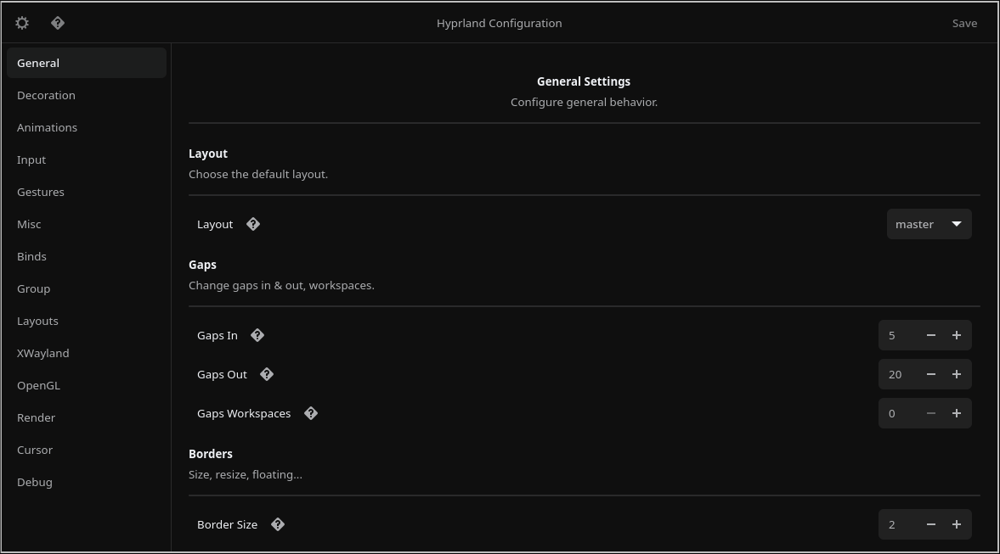

<div align='center'>

<h2>HyprGUI </h2>


An unofficial GUI for configuring Hyprland, built with GTK4 and Rust for Arch. 🚀🦀<br>
Comes with a custom hyprparser for Hyprland's configuration file.

## Preview


</div>

> [!CAUTION]
> This is a backup repository for [HyprUtils/hyprgui]<br>. It may be not fully up-to-date.
> It is not recommended to run this code **at all** :)

> Currently Testing and bringing it up to date

[HyprUtils/hyprgui]: https://github.com/HyprUtils/hyprgui

Install the package with:
```bash
git clone https://github.com/Firstp1ck/hyprgui.git
cd hyprgui
./build.sh
```

## Building from source
1. Install Rust (preferably `rustup`) through your distro's package or [the official script](https://www.rust-lang.org/tools/install)
2. Install `git` and `gtk4`
3. Clone this repository:
`git clone https://github.com/Firstp1ck/hyprgui.git && cd hyprgui`
4. Compile the app with `cargo build --release`, run it directly with `cargo run --release` or use `build.sh` script.

## Credits:
- [Nyx](https://github.com/nnyyxxxx) - Implementing the parser, rest of the GUI, and maintaining the project
- [Adam](https://github.com/adamperkowski) - Implementing the base GUI, maintaining the AUR packages and the project
- [Vaxry](https://github.com/vaxerski) - Hyprland
- [rust-gtk](https://github.com/gtk-rs/gtk4-rs) - The GTK4 library
- [Hyprland](https://github.com/hyprwm/Hyprland) - The wayland compositor